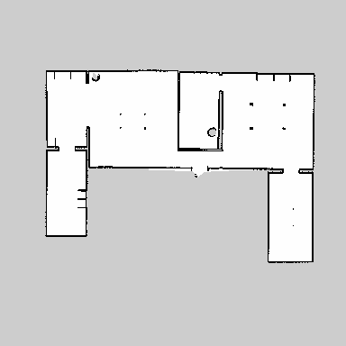
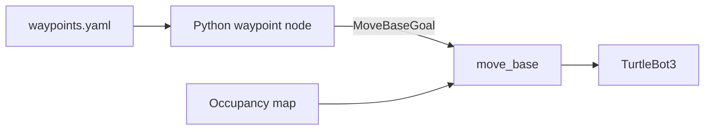

# TurtleBot3 Waypoint Navigation

A compact ROS 1 package that sends a TurtleBot3 through a configurable sequence
of target poses on a saved indoor occupancy map. The project uses a Python
`actionlib` client to submit `MoveBaseGoal` messages to the ROS Navigation Stack.



## Features

- Sequential waypoint navigation through the `/move_base` action server
- Human-readable waypoint configuration in YAML
- Position and yaw targets expressed in the `map` reference frame
- Configurable action-server and per-goal timeouts
- Success, failure, and timeout reporting through ROS logging
- Included TurtleBot3 House occupancy map and navigation launch file
- Automated repository checks for the map and waypoint configuration

## How it works



The node waits for `/move_base`, sends one target pose, and waits for its result
before continuing to the next waypoint. By default, navigation stops if a goal
times out or fails.

## Repository layout

| Path | Purpose |
| --- | --- |
| `scripts/waypoint_navigation.py` | ROS action client and waypoint executor |
| `config/waypoints.yaml` | Target poses and runtime settings |
| `launch/navigation.launch` | Starts TurtleBot3 navigation with the included map |
| `launch/waypoints.launch` | Loads the waypoint configuration and starts the client |
| `maps/map_house.pgm` | Indoor occupancy-grid image |
| `maps/map_house.yaml` | Map resolution, origin, and occupancy thresholds |
| `test/test_repository.py` | Standalone configuration and asset checks |

## Target environment

- Ubuntu 20.04
- ROS 1 Noetic
- Python 3
- TurtleBot3 Burger or Waffle Pi
- ROS Navigation Stack and TurtleBot3 packages

This repository intentionally targets ROS 1 because the original university
project was implemented with `rospy`, `actionlib`, and `move_base`.

## Build

Place the repository inside the `src` directory of a catkin workspace, then run:

```bash
cd ~/catkin_ws
rosdep install --from-paths src --ignore-src -r -y
catkin_make
source devel/setup.bash
```

Make the environment available automatically in new terminals if desired:

```bash
echo 'source ~/catkin_ws/devel/setup.bash' >> ~/.bashrc
```

## Run in TurtleBot3 House simulation

Install the official TurtleBot3 and TurtleBot3 simulation packages before
starting. Use a separate terminal for each step and source the catkin workspace
in every terminal.

1. Start the simulated house:

   ```bash
   export TURTLEBOT3_MODEL=burger
   roslaunch turtlebot3_gazebo turtlebot3_house.launch
   ```

2. Start localization and navigation with the included map:

   ```bash
   export TURTLEBOT3_MODEL=burger
   roslaunch turtlebot3_waypoint_navigation navigation.launch
   ```

3. In RViz, use **2D Pose Estimate** to align the robot with the map. Move the
   robot slightly if necessary until the laser scan aligns with the walls.

4. Start the waypoint client:

   ```bash
   roslaunch turtlebot3_waypoint_navigation waypoints.launch
   ```

The client visits the three original project waypoints in sequence.

## Run on a physical TurtleBot3

Follow the official TurtleBot3 bringup procedure on the robot and start the
navigation stack on the remote PC. Confirm localization in RViz before running:

```bash
roslaunch turtlebot3_waypoint_navigation waypoints.launch
```

> **Safety:** The robot will move as soon as the first goal is accepted. Keep the
> area clear, supervise the robot, and be ready to stop it.

## Customize the route

Edit `config/waypoints.yaml` or pass another file at launch time:

```bash
roslaunch turtlebot3_waypoint_navigation waypoints.launch \
  waypoints_file:=/absolute/path/to/my_waypoints.yaml
```

Each waypoint contains a label, an `(x, y)` position in metres, and a yaw angle
in radians:

```yaml
waypoints:
  - name: first_goal
    x: 0.7
    y: 1.6
    yaw: 0.675
```

## Runtime parameters

| Parameter | Default | Description |
| --- | ---: | --- |
| `~frame_id` | `map` | Coordinate frame used for target poses |
| `~move_base_action` | `/move_base` | Navigation action-server name |
| `~server_timeout` | `60.0` | Seconds to wait for the action server |
| `~goal_timeout` | `180.0` | Maximum seconds allowed for each goal |
| `~continue_on_failure` | `false` | Continue after a failed or timed-out goal |
| `~waypoints` | — | Ordered list of waypoint dictionaries |

## Validation

The checks do not require a ROS installation:

```bash
python3 -m pip install -r requirements-dev.txt
python3 -m py_compile scripts/waypoint_navigation.py
python3 -m unittest discover -s test -v
```

## Troubleshooting

- **The node times out waiting for `/move_base`:** start the navigation stack
  first and verify that the action topics exist with `rostopic list`.
- **The robot plans from the wrong location:** set the initial pose in RViz and
  confirm that the laser scan aligns with the occupancy map.
- **A waypoint is unreachable:** confirm that it lies in free map space and is
  outside inflated obstacle regions.
- **The map cannot be loaded:** keep `map_house.yaml` and `map_house.pgm` in the
  same directory; the YAML uses a relative image path.

## References

- [TurtleBot3 Navigation Manual](https://emanual.robotis.com/docs/en/platform/turtlebot3/navigation/)
- [ROS `move_base`](https://wiki.ros.org/move_base)
- [ROS `actionlib`](https://wiki.ros.org/actionlib)

## License

Distributed under the MIT License. See [LICENSE](LICENSE).
